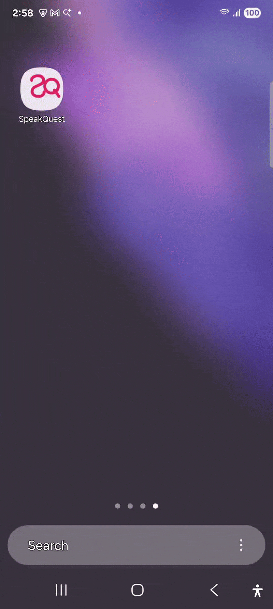

# SpeakQuest 🗣️퀘스트

[](https://www.android.com)
[](https://kotlinlang.org)
[](https://developer.android.com/jetpack/compose)
[](LICENSE)

SpeakQuest is a modern Android application designed to help users learn and practice new languages through interactive quests. This app serves as a demonstration of modern Android development practices.

<p align="center">
  
</p>

## ✨ Features

*   **Instant Translation:** Translates English text to Spanish in real-time as you type.
*   **Sentence Support:** Capable of translating full sentences, not just single words.
*   **Modern UI:** Built entirely with Jetpack Compose for a clean, reactive, and modern user interface.
*   **Light & Dark Theme:** Automatically adapts to system settings and includes a manual toggle for user preference.
*   **Responsive Design:** The interface is designed to work beautifully across different screen sizes.

## 🛠️ Built With

*   **[Kotlin](https://kotlinlang.org/)**: The official programming language for Android development.
*   **[Jetpack Compose](https://developer.android.com/jetpack/compose)**: Android’s modern, declarative UI toolkit.
*   **[Material 3](https://m3.material.io/)**: The latest version of Google's open-source design system, used for UI components.
*   **[ML Kit Translate](https://developers.google.com/ml-kit/language/translation)**: Google's on-device machine learning library used for instant and offline English-to-Spanish translation.
*   **[Coroutines & Flow](https://kotlinlang.org/docs/coroutines-overview.html)**: Used for managing asynchronous operations and handling streams of data, such as observing the translation state.
*   **[Android Jetpack](https://developer.android.com/jetpack)**:
    *   **ViewModel**: Manages UI-related data in a lifecycle-conscious way.
    *   **Lifecycle**: For creating lifecycle-aware components.
    * 

## ⚙️ Getting Started

### Prerequisites
*   Android Studio Meerkat Feature Drop | 2024.3.2 Patch 1
    Build #AI-243.26053.27.2432.13536105, built on May 22, 2025
*   Android SDK API Level 26 or newer.

### Installation & Setup

This project uses a self-hosted instance of [LibreTranslate](https://github.com/LibreTranslate/LibreTranslate) running in a Docker container for the translation service. This setup allows for offline, private, and free translations without relying on external cloud APIs.

#### 1. Clone the Repository: 
git clone https://github.com/nkechidev/speakquest.git

#### 2. Set Up the Local Translation Server (Docker)

The app requires a local translation server to communicate with. We'll use Docker to run LibreTranslate.

##### **Requirements:**
*   [Docker Desktop](https://www.docker.com/products/docker-desktop/) for macOS, Windows, or Linux.

##### **Procedure:**
1.  **Start Docker Desktop.**

2.  **Run the LibreTranslate Container:**
    This command starts the translation server, mapping it to port `5001` on your machine and loading only the English and Spanish models to conserve memory.

3.  **Verify the Server is Running:**
    Open your terminal and run the following `curl` command.

    You should see this response, confirming the server is active:
    ```json
    [
      {"code":"en", "name":"English"},
      {"code":"es", "name":"Spanish"}
    ]
      
#### 3. Configure the Android App
The Android app needs to know the correct URL to connect to the local server. This URL differs depending on whether you are using an emulator or a physical device.

**For Android Emulator:**
The emulator can access your computer's localhost via the special IP address 10.0.2.2. Update the base URL in the app's configuration:
`const val LIBRETRANSLATIONS_URL = "http://10.0.2.2:5001/"`

**For Physical Android Device (using** ngrok):
A physical device cannot directly access localhost on your computer. 
You need a tunneling service like **ngrok** to create a secure public URL that forwards to your local server.

1.**Start ngrok**: Run this command to expose your local port `5001`.

`ngrok http 5001`

2.**Get the Public URL**: ngrok will provide a public HTTPS URL. It will look something like this:
`https://<random-string>.ngrok.io`

3.**Update the App Configuration**: Use this new `ngrok` URL in your app's code.
`const val LIBRETRANSLATIONS_URL = "https://<random-string>.ngrok.io/" `

🔁 **Restarting the Setup**
If you restart your computer, you'll need to restart the services:
1.Start **Docker Desktop**.
2.Restart the LibreTranslate container:

`docker start libretranslate`

3.If using a physical device, restart ngrok and update the URL in the app:
    `ngrok http 5001`
    